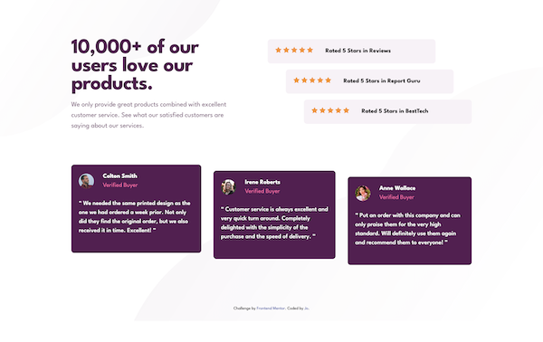

# Frontend Mentor - Social proof section solution

This is a solution to the [Social proof section challenge on Frontend Mentor](https://www.frontendmentor.io/challenges/social-proof-section-6e0qTv_bA). Frontend Mentor challenges help you improve your coding skills by building realistic projects. 

## Table of contents

- [Overview](#overview)
  - [Screenshot](#screenshot)
  - [Links](#links)
- [My process](#my-process)
  - [Built with](#built-with)
  - [What I learned](#what-i-learned)
- [Acknowledgments](#acknowledgments)

**Note: Delete this note and update the table of contents based on what sections you keep.**

## Overview
Coded using Tailwind CSS. Seek advise from ChatGPT.

### Screenshot

### Links

- Solution URL: https://github.com/leeejo/FM-challenge/tree/FM-challenge-codespace/social-proof-section-master
- Live Site URL: https://leeejo.github.io/FM-challenge/social-proof-section-master/

## My process

### Built with

- Semantic HTML5 markup
- CSS custom properties
- Flexbox
- Grid
- Mobile-first workflow

### What I learned

How to harness Chatgpt to help in the exploration and thinking process. Chatgpt shown me different ways to create the same effect.

## Acknowledgments

Credit to https://chat.openai.com/ for the guidance.
