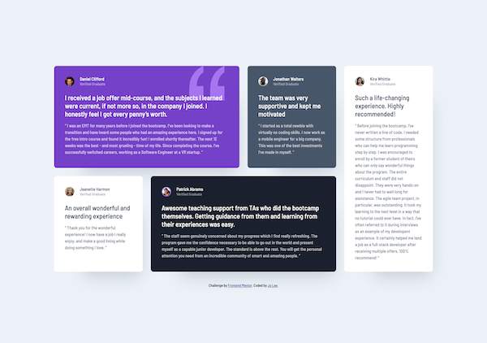
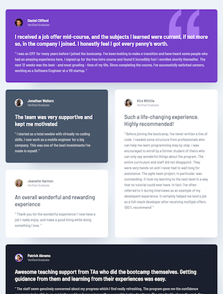

# Frontend Mentor - Testimonials grid section solution

This is a solution to the [Testimonials grid section challenge on Frontend Mentor](https://www.frontendmentor.io/challenges/testimonials-grid-section-Nnw6J7Un7). Frontend Mentor challenges help you improve your coding skills by building realistic projects. 

## Table of contents

- [Overview](#overview)
  - [The challenge](#the-challenge)
  - [Screenshot](#screenshot)
  - [Links](#links)
- [My process](#my-process)
  - [Built with](#built-with)
  - [What I learned](#what-i-learned)
  - [Continued development](#continued-development)
  - [Useful resources](#useful-resources)
- [Author](#author)
- [Acknowledgments](#acknowledgments)

## Overview

### The challenge

Users should be able to:

- View the optimal layout for the site depending on their device's screen size

### Screenshot

### Links

- Solution URL: https://github.com/leeejo/FM-challenge/tree/FM-challenge-codespace/testimonials-grid-section-main
- Live Site URL: https://leeejo.github.io/FM-challenge/testimonials-grid-section-main/

## My process

### Built with

- Semantic HTML5 markup
- CSS Grid
- Mobile-first workflow

### What I learned

I had better understand of what CSS Grid can do and bring the best out of it. Totally recommend watching Kevin Powell video (link below). He gave very simple and easy to understand explaination.

## Acknowledgments

Setup CSS from https://www.youtube.com/watch?v=rg7Fvvl3taU
